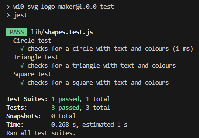

# w10-svg-logo-maker

## Description

This is a command-line application which generates a simple logo based on a user's input.

## Installation

1. Download or clone this repository
2. [node.js](https://nodejs.org/en) is required for this application.
3. `npm i` in the terminal to install the required npm packages.

## Usage

1. The application will be invoked by using the following command: `npm start`

2. User is prompted with questions in regards to making the logo.

3. When questions are answered, an SVG file for the logo is generated with the provided text and colours.

Below are examples of logos generated from this application.

To see how this application works, follow the [Walkthrough Video](https://drive.google.com/file/d/1bBIQpQcLv17lWGE1pqUCLWBbO49AcXAu/view?usp=sharing).

## Test

This project is tested with [jest](https://www.npmjs.com/package/jest). Use the command `npm test` to invoke the test.

## License

Please refer to the LICENSE in the repo.

---
